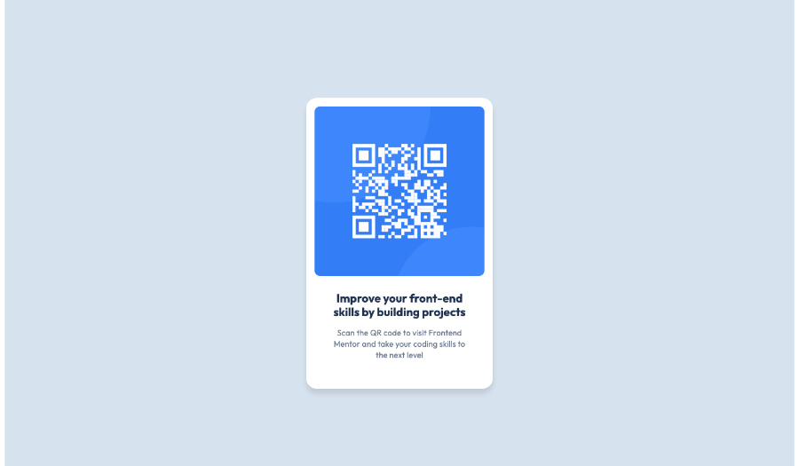

# Frontend Mentor - QR code component solution

This is a solution to the [QR code component challenge on Frontend Mentor](https://www.frontendmentor.io/challenges/qr-code-component-iux_sIO_H). Frontend Mentor challenges help you improve your coding skills by building realistic projects. 

## Table of contents

- [Overview](#overview)
  - [Screenshot](#screenshot)
  - [Links](#links)
- [My process](#my-process)
  - [Built with](#built-with)
  - [What I learned](#what-i-learned)
  - [Continued development](#continued-development)
  - [Useful resources](#useful-resources)
- [Author](#author)
- [Acknowledgments](#acknowledgments)

## Overview

### Screenshot

### Links

- GitHub Solution URL: [Add solution URL here](https://github.com/JakeH42/qr-code-component-main)
- Live Site URL: [Add live site URL here](https://qr-code-component-main-sand-one.vercel.app/)

## My process

### Built with

- Semantic HTML5 markup
- CSS custom properties
- CSS Grid
- CSS Clamp for dynamic spacing
- Custom CSS utility classes
- BEM - Block Element Modifier class naming convention 

### What I learned

I learnt that CSS has a 'font' shorthand that takes the following values:
	•	font-style
	•	font-variant
	•	font-weight
	•	font-size (required)
	•	line-height (optional, but paired with font-size using /)
	•	font-family (required)

### Continued development

I need to realise where to use utility classes instead of styling directly on the component itself for best practices in terms of scalability.

I need to understand GitHub and Git better - in particular how to setup repos, how to do branches and how to submit code for review as I realise this is important for team collaboration.

### Useful resources

- [Example resource 1](http://meyerweb.com/eric/tools/css/reset/ ) - CSS Reset by Eric Meyer - I will use this going forward as it is super simple and sets the stage nicely for custom CSS

## Author

- Frontend Mentor - [@yourusername](https://www.frontendmentor.io/profile/JakeH42)

## Acknowledgments

Kevin Powell - this YouTuber taught me the majority of my CSS knowledge and I cannot thank him enough for his excellence when it comes to teaching CSS.
